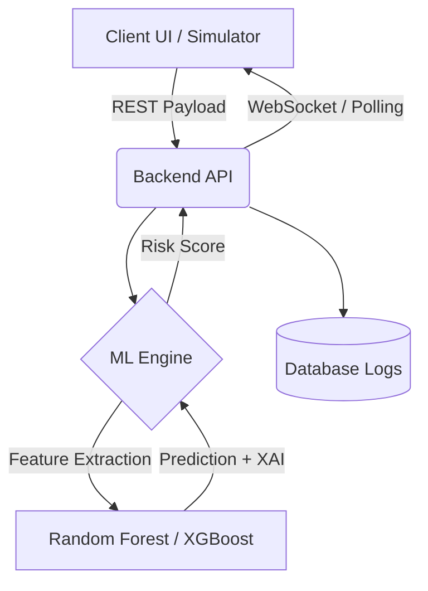

# 📄 TECHNICAL REQUIREMENT DOCUMENT (TRD)

## 🚀 SecurePay-AI – Real-Time Fraud Detection SaaS Platform

### 1. 🧠 System Overview
**System Name:** SecurePay-AI
**Type:** AI-powered SaaS Web Platform
**Purpose:** Provide sub-second real-time fraud detection leveraging a Transaction Simulator, Payment Gateway Test Integrations, and cutting-edge Machine Learning.

### 2. 🏗️ High-Level System Architecture


### 3. 🧩 System Components
#### 🔹 Frontend Layer
- **Tech:** Vanilla JS SPA (or React for scaling), CSS3 Neon Glassmorphism.
- **Features:** Live Dashboard, JSON payload simulator, Rule engine interface, API provisioning.
#### 🔹 Backend API Layer
- **Tech:** Node.js / FastAPI (Python).
- **Responsibilities:** Routing, Auth, Rate Limiting, Business Rules execution.
#### 🔹 ML Engine
- **Model:** Random Forest
- **Tasks:** Inference, Risk Scoring, XAI (Explainable AI - providing English readable reasons for blocks).
#### 🔹 Database Layer
- **Tech:** PostgreSQL (Relational) + Redis (In-memory caching/Rate Limiting).
- **Stores:** User API scopes, transaction hashes, analytical aggregate data.

### 4. ⚙️ Functional Requirements
**Core Requirements:**
- ML Fraud Prediction mapped to `0-100` Risk Index.
- Explainable AI output strictly formatted in resulting JSON.
- Live data pipeline for the Analytics Dashboard.
**Advanced Requirements:**
- Secure API key generation & validation.
- RBAC (Role-Based Access Control) for users.
- Custom Rules evaluation prioritizing standard ML outputs.

### 5. 🔧 Non-Functional Requirements (NFRs)
- **Performance:** End-to-end inference under `< 800 milliseconds`.
- **Scalability:** Capable of 1000+ concurrent API TPS.
- **Security:** HTTPS/TLS 1.2+, JWT Auth, AES-256 for at-rest keys.
- **Availability:** 99.9% uptime SLA design.

### 6. 🧠 Machine Learning Pipeline Steps
1. Data Ingestion & Cleansing
2. Feature Scaling & Normalization
3. SMOTE (Synthetic Minority Over-sampling Technique)
4. Model Training & Hyperparameter Tuning
5. Deployment (.pkl / ONNX Format)

### 7. 🔌 API Design Specs
#### `POST /predict`
Evaluates a single transaction.
**Request:**
```json
{
  "amount": 45000,
  "currency": "INR",
  "distance_km": 150,
  "merchant_category": "electronics"
}
```
**Response:**
```json
{
  "prediction": "Fraud",
  "risk_score": 92,
  "action": "BLOCK",
  "reason": "High transaction amount + uncommon geolocation"
}
```

### 8. 🗄️ Database Schema (Core Example)
**Transactions Table**
| Field | Type | Description |
|-------|------|-------------|
| `txn_id` | UUID | Primary Key |
| `org_id` | INT | Foreign Key (Organization) |
| `amount` | FLOAT | Transaction size |
| `risk_score` | INT | Engine generated |
| `timestamp` | DATETIME| Indexed for time-series |

### 9. 🔐 Security Architecture
- JWT (JSON Web Tokens) for console sessions.
- Rolling API keys (Starts with `sk_live_...`).
- Strict rate limiting via sliding window algorithms to prevent DDOS.

### 10. 🧪 Testing Strategy
- Unit tests for feature extraction logic.
- Integration tests simulating load across the ML boundary.
- Visual UI regression testing for the Dashboard.

### 11. 🚀 Deployment Architecture
- **Frontend** → Vercel CDN
- **API** → AWS EC2 / Render (Dockerized)
- **DB** → MongoDB Atlas / AWS RDS

---
### 🔥 FINAL TECH LINE (INTERVIEW KILLER)
> *“SecurePay-AI is designed as a highly scalable AI-driven SaaS platform, intricately blending real-time APIs, robust simulation, and explainable machine learning boundaries to eradicate payment fraud at the enterprise level.”*
